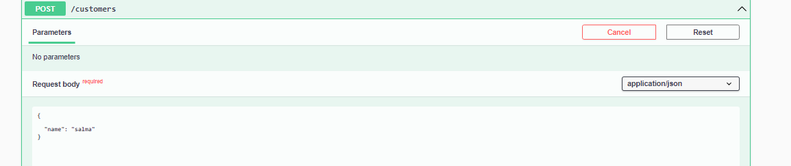

<h1>Compte rendu du backend de Ebanking</h1>
<h3>Introduction :</h3>

Ce travail est une mise en place d'un projet de banque électronique où le client, son compte courant et épargne, ainsi que l'historique de ses opérations, sont gérés en utilisant JEE Spring Boot avec une architecture MVC. La partie backend comprend les Entités, les Répertoires, les DTOs, les Mappers, les Services et les RestControllers.

On souhaite créer une application qui permet de gérer des comptes bancaires. Chaque compte appartient à un client. Un compte peut subir plusieurs opérations de type DEBIT ou CREDIT. Il existe deux types de comptes : comptes courants et comptes épargne.

<h3>Introduction :</h3>

Ce travail est une mise en place d'un projet de banque électronique où le client, son compte courant et épargne, ainsi que l'historique de ses opérations, sont gérés en utilisant JEE Spring Boot avec une architecture MVC. La partie backend comprend les Entités, les Répertoires, les DTOs, les Mappers, les Services et les RestControllers.

On souhaite créer une application qui permet de gérer des comptes bancaires. Chaque compte appartient à un client. Un compte peut subir plusieurs opérations de type DEBIT ou CREDIT. Il existe deux types de comptes : comptes courants et comptes épargne.

<h3>Single Table  </h3>

Dans la stratégie Single Table, toutes les classes de la hiérarchie d'héritage sont mappées sur une seule table. Une colonne discriminante (discriminator column) est utilisée pour distinguer les différentes sous-classes. Cette colonne contient un identifiant unique pour chaque type d'entité, ce qui permet de savoir à quelle sous-classe appartient chaque ligne de la table.

<h3>Liste des operations </h3>

Client et Compte : Un client peut avoir plusieurs comptes, d'où la relation @OneToMany entre Client et Compte.
Compte et Operation : Un compte peut avoir plusieurs opérations, d'où la relation @OneToMany entre Compte et Operation.

<h3>Test des fonctionnalites BY Postman </h3>
<h4>Get customers </h4>

<h4>Get customers by Id </h4>

<h4>Get accounts </h4>

<h4>Get accounts By Id  </h4>

<h4>Ajouter Un debit </h4>

<h4>Interface de Swagger</h4>

<h4>Get avec Swagger</h4>

<h4>Les differents Requests de mon application</h4>

<h4>Get customer by Id aveec Swagger</h4>

<h4>Post avec Swagger</h4>

<h4>Resultata de Post</h4>

<h4>Aps-docs des donnees json de mon application</h4>

<h4>Get account By id </h4>

<h4></h4>

Selectionner les ooperations d'un compte 

<h4>Consulter une page parmis les operations (par defaout page 0)</h4>

<h4>Selectionner la page 1 des operations </h4>

<h4>Preciser le nombre des operations par page </h4>

<h2>La partie de securite avec Spring Security </h2>

Pour sécuriser l'application backend de e-banking, j'ai configuré Spring Security pour utiliser les JSON Web Tokens (JWT) pour l'authentification et l'autorisation des utilisateurs. Voici les points clés de cette configuration :

### Annotations de Classe Principales
- `@Configuration` : Déclare la classe comme source de configuration.
- `@EnableWebSecurity` : Active la sécurité web de Spring Security.
- `@EnableMethodSecurity(prePostEnabled = true)` : Permet l'utilisation des annotations de sécurité au niveau des méthodes.

### Gestion des Utilisateurs
- Utilisation d'un **InMemoryUserDetailsManager** pour stocker les utilisateurs en mémoire avec des mots de passe cryptés à l'aide de BCrypt.
- Deux utilisateurs sont définis : `user1` avec le rôle `USER` et `admin` avec les rôles `USER` et `ADMIN`.

### Chaîne de Filtrage de Sécurité
- Configuration de la session en mode sans état (stateless).
- Désactivation de la protection CSRF.
- Autorisation des requêtes vers `/auth/login/**` et authentification requise pour toutes les autres requêtes.
- Configuration du serveur de ressources OAuth2 pour utiliser JWT.

### JWT (JSON Web Tokens)
- **Encodeur JWT** : Utilisé pour créer des JWT en utilisant une clé secrète.
- **Décodeur JWT** : Utilisé pour valider les JWT avec l'algorithme HS512.

### CORS (Cross-Origin Resource Sharing)
- Configuration pour permettre toutes les origines, méthodes et en-têtes, afin de faciliter la communication entre le frontend et le backend.

### Points de Terminaison dans `SecurityController`
- `@GetMapping("/profile")` : Retourne les détails de l'utilisateur authentifié actuel.
- `@PostMapping("/login")` : Authentifie l'utilisateur et génère un JWT qui est retourné comme jeton d'accès.

<h4>
En résumé, cette approche permet de :

Centraliser la gestion des entités : En utilisant une seule table pour les différents types de comptes, nous facilitons la gestion et les modifications futures.
 
Assurer la cohérence des données : Les relations entre les entités garantissent que chaque opération est correctement associée à un compte et, par extension, à un client. 
garantit une sécurité robuste pour l'application backend, en utilisant JWT pour l'authentification et l'autorisation, tout en permettant une flexibilité avec la configuration CORS.
 
Optimiser les performances : La stratégie Single Table permet des opérations de requêtes rapides et efficaces, en évitant les jointures complexes entre plusieurs tables.
 

Simplifier le développement : Avec Spring Boot et JPA, le code reste lisible et maintenable, tout en permettant de tirer parti des puissantes fonctionnalités offertes par ces frameworks.</h4>

